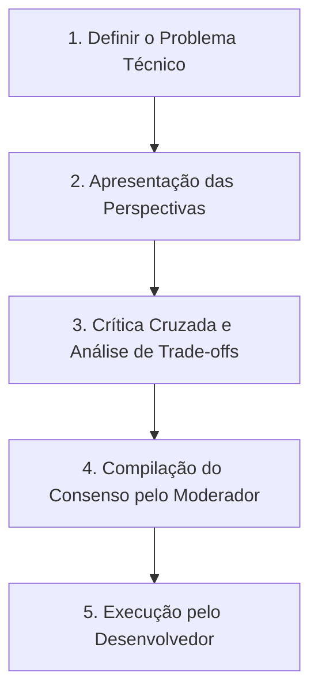

# SKILL — LLM Council (Conselho de Especialistas)
## Tomada de Decisão Multipersona para Arquitetura, UX & Visão
*Aplicar ao debater decisões críticas de engenharia, banco de dados, design de alta fidelidade — e decisões de visão, identidade e rumo do Oráculo*

---

## 👥 Personas do Conselho

Quando houver uma decisão importante, ative o conselho invocando os seguintes especialistas internos:

1. **Moderador 🎙️**
   * **Foco:** Orquestrar o debate, manter a clareza do objetivo e compilar o consenso final com base nos prós e contras.
2. **Arquiteto de Software 🏗️**
   * **Foco:** Segurança, escalabilidade, latência (Notion API latency), integridade de dados relacionais e legibilidade do código (clean code).
3. **Diretor de Experiência (UX/UI) 🎨**
   * **Foco:** Estética visual (Cine Terroso), micro-animações, estados de carregamento (skeletons), facilidade de edição inline e responsividade.
4. **Produtor Executivo (Finanças/Viabilidade) 💼**
   * **Foco:** Custo de tokens das APIs, tempo de desenvolvimento, simplicidade das chamadas ao Notion/Drive e alinhamento prático com o fluxo da Firma Abacaxi.
5. **Guardião da Narrativa 🜍**
   * **Foco:** Identidade, sentido e coerência da história — da Firma e do Felipe. Pergunta sempre: *essa decisão fortalece ou dilui quem somos?* Traz o repertório de arquétipos, psicologia junguiana, tarô e dramaturgia para avaliar se a escolha técnica serve à narrativa maior. É a voz que impede o sistema de virar burocracia sem alma.
   * **Quando entra:** obrigatório em decisões de visão, identidade, estrutura do Cérebro, nome de coisas e tudo que toca a vida pessoal do Felipe. Opcional (mas bem-vindo) em decisões puramente técnicas.

---

## 🔄 Fluxo de Discussão (O Processo)

1. **Apresentação:** Cada persona apresenta sua proposta inicial para o problema.
2. **Crítica Cruzada:** O Arquiteto questiona a performance da ideia do UX; o UX questiona a frieza da ideia do Arquiteto; o Produtor avalia a viabilidade; o Guardião da Narrativa verifica se o consenso técnico não trai a identidade.
3. **Consenso:** O Moderador resolve os impasses e define o plano consolidado.
4. **Questionamentos abertos:** O que o conselho não pode decidir sozinho (valores, limites, nomes, rituais) vira pergunta explícita para Lipe/Jaya — registrada no documento de saída.

---

## 📝 Exemplo de Aplicação (Decisão de Caching vs. Realtime)
* **Arquiteto:** *"Devemos fazer cache de 60s em todas as tabelas do Notion para evitar rate limit e latência de 1s por request."*
* **UX:** *"Se o usuário editar o status no dashboard e demorar 60s para atualizar visualmente, a experiência parecerá quebrada e lerda."*
* **Produtor:** *"Faremos revalidação imediata do cache local no estado do React (Optimistic UI) para o UX ficar instantâneo, enquanto salvamos assincronamente no Notion em background."*
* **Moderador:** *"Consenso estabelecido: Optimistic Updates no front-end para resposta imediata + mutações em background no Notion API."*
